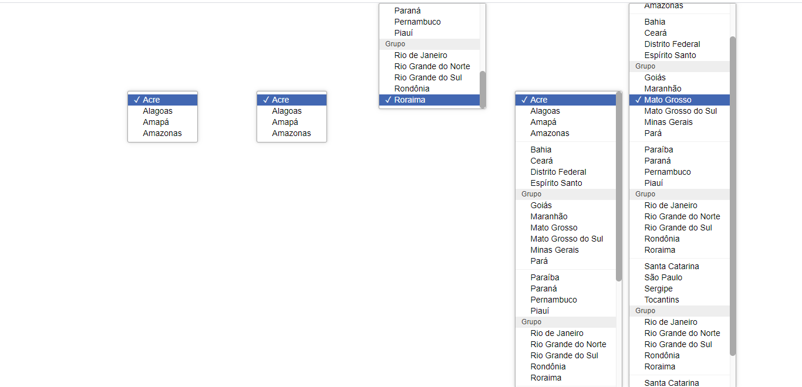

# Select Drop Down Menu
[](https://www.npmjs.com/package/app-select)

## Features
+ **Standard style** (Estido padrão para todos os navegadores)
+ **Automatic resizing** (Redimencinamento automático com barra de rolagem automática)

## Estrutura
+ **select**
    - id - Relaciona-se com o name do input

+ **output**
``` html 
<div class="select-output">Escholha seu estado</div>
```
    - `.select-output` - __required__

+ **output CSS** - Estilos personalizáveis
``` css 
    background-color
    padding-(top, right, bottom, left)
    width
```

+ **option**
``` html 
<div value="Brazil" class="option">Brazil</div>
```
    + `.option` - __required__
    + `attr value` - __required__
    + `.selected` - Opção selecionada
    + `.disabled` - This Boolean attribute indicates that the user cannot interact with the control

+ **Separator** Elemento reponsavel pela linha horizontal que divide elementos
``` html 
<hr class="separator"> 
```
    - `small` Tagname
    - `.separator` required

+ **Option Group** 
``` html 
    <small class="optgroup">Nome do grupo</small>
```
    - `small` Tagname 
    - `.optgroup` required

## Resultado
``` html
<div class="select" id="state3">
    <div class="select-output">Escholha seu estado</div>
    <div class="options" id="1">
        <div value="AC" class="option">Acre</div>
        <div value="AL" class="option">Alagoas</div>
        <div value="AP" class="option">Amapá</div>
        <div value="AM" class="option">Amazonas</div>
        <small class="optgroup">Surdeste</small>
        <div value="BA" class="option">Bahia</div>
        <div value="CE" class="option">Ceará</div>
        <div value="DF" class="option">Distrito Federal</div>
        <div value="ES" class="option">Espírito Santo</div>
        <hr class="separator">
        <div value="GO" class="option">Goiás</div>
        <div value="MA" class="option">Maranhão</div>
        <div value="MT" class="option">Mato Grosso</div>
        <div value="MS" class="option">Mato Grosso do Sul</div>
        <div value="MG" class="option">Minas Gerais</div>
        <div value="PA" class="option">Pará</div>
    </div>
</div>
```

# Dependences
+ [OOCSS](https://github.com/guilhermeHenry/oocss)
+ [Apps Helpers](https://www.npmjs.com/package/apps-helpers)
